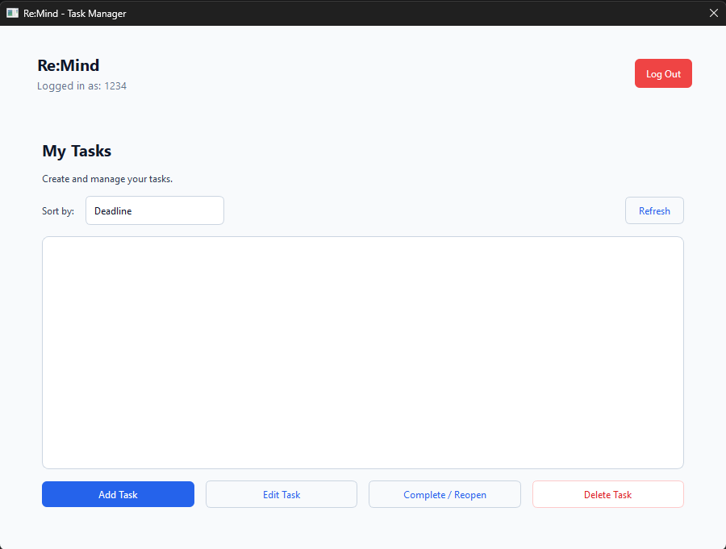
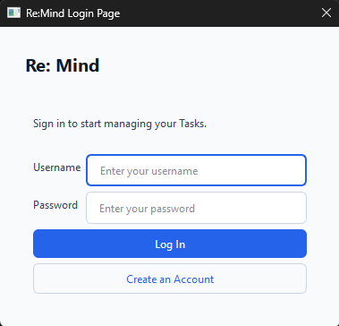

# Re:Mind

## Project Description

**Re:Mind** is a desktop task management system that allows users to create an account, log in, and manage their own tasks. Each task can contain a title, description, priority, optional deadline, and completion status.

The project addresses the need for a simple way to organize personal tasks and keep track of deadlines, priorities, and completed work. Tasks are stored locally so they remain available after the application is closed.

## Project Objectives

The main objectives of Re:Mind are to:

- Provide a simple desktop application for managing personal tasks.
- Allow users to register and log in to their own account.
- Allow users to create, view, edit, complete, reopen, and delete tasks.
- Organize tasks by deadline, priority, or title.
- Store user and task information using a local database.
- Apply object-oriented programming and a layered project structure.

## Features

- **User Registration** – Creates a user account with username and password validation.
- **User Login and Logout** – Allows registered users to access and leave their account.
- **Create Tasks** – Adds tasks with a title, description, priority, and optional deadline.
- **View Tasks** – Displays tasks belonging to the currently logged-in user.
- **Edit Tasks** – Updates an existing task's information.
- **Delete Tasks** – Removes a selected task after confirmation.
- **Complete / Reopen Tasks** – Changes the completion status of a task.
- **Task Priority** – Supports Low, Medium, and High priority levels.
- **Deadlines and Urgency** – Identifies tasks as overdue, urgent, soon, normal, or without a deadline.
- **Task Sorting** – Sorts tasks by deadline, priority, or title.
- **Data Persistence** – Saves users and tasks in an SQLite database.

## Technologies Used

- **Programming Language:** Python 3
- **GUI Framework:** PyQt6
- **Database:** SQLite
- **Styling:** Qt Style Sheets (QSS)
- **Other Tools:** Git and GitHub
- **Python Standard Libraries:** `sqlite3`, `datetime`, `pathlib`, and `sys`

## Project Structure

```text
Re-Mind/
├── assets/
│   └── style.qss
├── database/
│   ├── __init__.py
│   └── database.py
├── features/
│   ├── auth/
│   │   ├── __init__.py
│   │   ├── models.py
│   │   ├── repository.py
│   │   ├── service.py
│   │   └── view.py
│   └── tasks/
│       ├── __init__.py
│       ├── models.py
│       ├── repository.py
│       ├── service.py
│       └── view.py
├── main.py
└── prototype.py
```

### Important Files and Folders

- `main.py` – Starts the application, creates the database and services, and controls the login and main-window flow.
- `assets/style.qss` – Contains the visual styling of the PyQt6 interface.
- `database/database.py` – Handles the SQLite connection and creates the required database tables.
- `features/auth/` – Contains the model, repository, service, and GUI for user registration and authentication.
- `features/tasks/` – Contains the model, repository, service, and GUI for task management.
- `prototype.py` – Earlier prototype of the application.

The project generally follows this flow:

```text
View -> Service -> Repository -> Database
```

The View handles the interface, the Service handles validation and business rules, the Repository handles database queries, and the Database class manages SQLite connections and table creation.

## Installation and Setup

### Requirements

Before running the project, install:

- Python 3
- PyQt6
- Git (optional, for cloning the repository)

### Steps

1. Clone the GitHub repository:

```bash
git clone https://github.com/JustinBerzamina/Re-Mind.git
```

2. Open the project folder:

```bash
cd Re-Mind
```

3. Create a virtual environment:

```bash
python -m venv .venv
```

4. Activate the virtual environment.

Windows:

```bash
.venv\Scripts\activate
```

macOS/Linux:

```bash
source .venv/bin/activate
```

5. Install PyQt6:

```bash
pip install PyQt6
```

6. Run the application:

```bash
python main.py
```

The program automatically creates `remind.db` when the application is first run.

## How to Use the System

1. Open the application by running `main.py`.
2. Select **Create an Account** if you do not have an account.
3. Enter a username and password, then register.
4. Log in using the registered account.
5. Select **Add Task** to create a new task.
6. Enter the task title, description, priority, and optional deadline.
7. Select a task and use **Edit Task** to update it.
8. Use **Complete / Reopen** to change its completion status.
9. Use **Delete Task** to permanently remove a selected task.
10. Use the **Sort by** menu to sort tasks by deadline, priority, or title.
11. Select **Log Out** when finished.

## OOP Implementation

Re:Mind uses classes to separate the responsibilities of the application.

Important classes include:

- `User` – Represents a registered user.
- `Task` – Represents a task and its data.
- `Database` – Handles database connections and table creation.
- `UserAuthRepository` – Performs database operations related to users.
- `UserAuthService` – Handles registration, login validation, and the current user.
- `UserAuthView` – Provides the registration and login interface.
- `TaskRepository` – Performs database operations related to tasks.
- `TaskService` – Handles task validation, sorting, and urgency rules.
- `TaskView` – Displays and manages tasks in the GUI.
- `TaskDialog` – Provides the form used to add or edit a task.
- `MainWindow` – Displays the main task-management interface after login.

### Encapsulation

Encapsulation is applied by separating data, business logic, database operations, and interface code into their own classes. For example, `TaskService` performs task validation while `TaskRepository` is responsible for SQL operations.

### Inheritance

Inheritance is used mainly through PyQt6. Classes such as `MainWindow`, `UserAuthView`, and `TaskDialog` inherit from `QDialog`, while `TaskView` inherits from `QWidget`.

### Polymorphism

The project mainly uses polymorphism through PyQt6 inheritance. Custom GUI classes inherit and use behavior provided by Qt classes while defining their own application-specific behavior.

## Database

Re:Mind uses an SQLite database named `remind.db`.

### `users` Table

The `users` table stores:

- `id` – Unique user ID
- `username` – Unique username
- `password` – Password used by the school-project authentication system

### `tasks` Table

The `tasks` table stores:

- `id` – Unique task ID
- `user_id` – ID of the user who owns the task
- `title` – Task title
- `description` – Task description
- `deadline` – Optional task deadline
- `priority` – Low, Medium, or High
- `is_completed` – Indicates whether the task is completed

`user_id` is a foreign key connected to the `users` table. Tasks are therefore associated with a specific user.

### Database Operations

The system performs the following main operations:

- **Create** – Register users and add tasks.
- **Read** – Find users during login and load a user's tasks.
- **Update** – Edit task information and change completion status.
- **Delete** – Delete tasks.
- **Sorting** – Retrieved tasks can be sorted by deadline, priority, or title.

A separate text-search feature is not currently implemented.

## Screenshots

### Task Management



The main task-management screen allows the logged-in user to view tasks, choose a sorting method, and add, edit, complete/reopen, or delete tasks.

### Login and Registration



The authentication screen allows a user to log in or create a new account.

## Testing

The system can be tested using the following cases:

| Test | Expected Result | Actual Result |
| --- | --- | --- |
| Register with valid information | Account is created | Passed |
| Register with passwords that do not match | Registration is rejected | Passed |
| Log in with correct credentials | Main task screen opens | Passed |
| Log in with incorrect credentials | Login is rejected | Passed |
| Create a valid task | Task appears in the task list | Passed |
| Create a task with a past deadline | Task is rejected | Passed |
| Edit an overdue task without changing its deadline | Other task information can still be updated | Passed |
| Complete and reopen a task | Task status changes correctly | Passed |
| Delete a task | Task is removed after confirmation | Passed |
| Sort tasks | Tasks are reordered using the selected option | Passed |
| Log out | User returns to the login screen | Passed |

## Known Issues / Limitations

- Passwords are stored as plain text because the application is a school project and does not currently implement password hashing.
- The application uses a local SQLite database and is intended for local desktop use.
- There is no separate task search function.
- There are no online accounts or cloud synchronization.
- Deadlines are displayed in the application, but the system does not send external notifications or reminders.

## Author

**Name:** Justin Berzamina  
**Section:** 3581

## GitHub Repository

https://github.com/JustinBerzamina/Re-Mind
